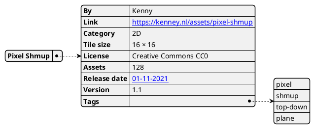
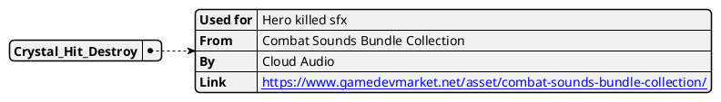
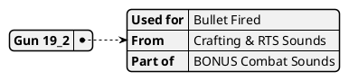
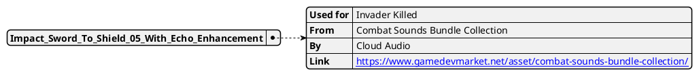
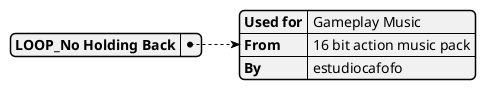
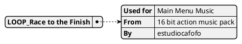
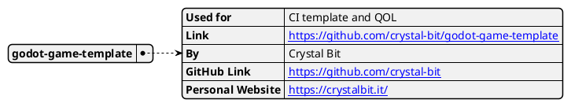
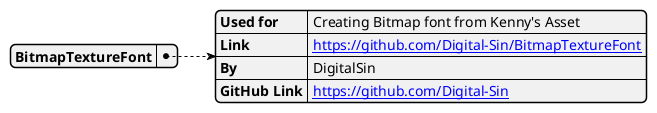

# Cosmos Conquerors

Role Reversed Space Invaders

## Game Details

### Player (Invader) Character Details

- You control the mob of invaders  
	- move the whole mob at once  

### NPC (Hero) Details

- The hero tries to kill a random invader  
	- selects one remaining invader  
	- ~~calculates with 100% accuracy depending on the player’s current speed~~
	- ~~adds random angle based on level~~
		- ~~higher level → less RNG → stronger hero~~  
	- move towards it
		- speed gets higher with higher levels

### Mechanics

- Press spacebar to shoot 1 bullet randomly from the mob  
	1. More invaders → More health → More RNG → Less reliable  
- Number of invaders carry over  
	- Health doesn’t reset → Game gets harder and harder → Eventually leading to game end

### Features

#### ~~Randomly Generated Background~~

1. ~~fill background with grass tile~~
2. ~~layer multiple noise maps with threshold for each of the following~~
	1. ~~trees~~
	2. ~~lakes~~

#### Score Calculation

$$
HeroScore = 1000 * HerosKilled
$$

$$
InvaderScore = NoOfInvadersWhenHeroKilled * 50
$$

$$
TotalScore = HeroScore + InvaderScore
$$

---

## Game Screenshot while #Developing

![[Attachment/Pasted image 20230708003757.png]]

Seeing concept image for the game

![[Attachment/Pasted image 20230708182857.png]]

shooting works, 1080p resolution, score works

![[Attachment/Pasted image 20230708183352.png]]

added canvas modulate + you can see the score in console 

final product ig

---

## Attributions

 [Pixel Shmup](https://kenney.nl/assets/pixel-shmup) by [Kenny](https://kenney.nl/) #PoweredByKennyAssets

[Crystal_Hit_Destroy](https://www.gamedevmarket.net/asset/combat-sounds-bundle-collection/) by [Cloud Audio](https://www.gamedevmarket.net/member/albertfernandez) 

Gun 19_2  

Impact_Sword_To_Shield_05_With_Echo_Enhancement  

LOOP_No Holding Back  

LOOP_Race to the Finish

[godot-game-template](https://github.com/crystal-bit/godot-game-template) by [Crystal Bit](https://crystalbit.it/)

[BitmapTextureFont](https://github.com/Digital-Sin/BitmapTextureFont) By [DigitalSin](https://github.com/Digital-Sin)

